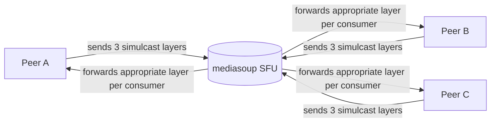

# openmeet

> *Open-source group video calling. A WebRTC SFU you can read in an afternoon.*

<p align="left">
  <a href="https://github.com/krish9219/openmeet/stargazers"></a>
  <a href="https://github.com/krish9219/openmeet/blob/main/LICENSE"></a>
  
  
  
  
</p>

Most "open-source Zoom" projects either (a) wrap an existing iframe and call themselves a Zoom clone, or (b) ship 100k lines of code you'll never read. openmeet is the actual thing in the middle: a real Selective Forwarding Unit (mediasoup), real WebSocket signaling, a vanilla-JS client, simulcast for quality at scale, chat, breakout rooms, optional auth, mobile-responsive UI — and it all fits on a few screens of code.

```bash
git clone https://github.com/krish9219/openmeet
cd openmeet
npm install
npm start
# open http://localhost:3000 in two browser tabs, join the same room name
```

## How group video actually works



A mesh (every peer sends to every other peer) is N² connections — your laptop's upload dies past 3 people. An **SFU** fixes the upload problem: every peer sends *once* to the server; the server forwards each stream to every other peer. **Simulcast** adds quality control: each peer encodes 3 quality layers (low/medium/high) and the SFU picks the right one per consumer based on their tile size and bandwidth. These two choices together are why this scales past a handful of peers.

## Features

- **Real SFU** — mediasoup. The same library backing Discord, Around, and plenty of production stacks.
- **Simulcast** — 3-layer encoding (100k / 300k / 900k bitrate) so the SFU can downshift quality per consumer.
- **Audio + video + screen share** — three independent producers per peer; mute/unmute each independently.
- **Chat** — WebSocket-broadcast text chat per room. History buffered server-side (last 200 messages) so late joiners catch up.
- **Breakout rooms** — click ⎙ to spin off a sub-room; the URL goes to chat + clipboard, you teleport in.
- **Optional room password** — set `ROOM_PASSWORD` env var; clients prompt for it on join, or pass via `?pwd=` URL param.
- **TURN configurable** — `ICE_SERVERS` env var accepts the same JSON shape WebRTC takes; works with Cloudflare TURN, Twilio NTS, Metered, Xirsys.
- **Mobile-responsive** — touch targets, single-column grid on small screens, chat panel switches from sidebar to fullscreen overlay, safe-area insets respected.
- **iOS Safari quirks handled** — `playsinline`, explicit `.play()` calls, user-gesture audio resume, `facingMode: "user"` for front camera.
- **Vanilla JS client** — no React, no build step. ESM-only via `esm.sh`. Open `public/client.js` and read it top to bottom.
- **Lazy rooms** — first peer creates the mediasoup Router; last peer out destroys it. No DB, no cleanup job.

## Quick start

```bash
git clone https://github.com/krish9219/openmeet
cd openmeet
npm install      # compiles the mediasoup C++ worker (~30s)
npm start
```

Open **http://localhost:3000**, enter a name and room, hit Join. Open a second browser tab (or another machine on the same network), join the same room name. You should see each other.

To test on two machines on the same Wi-Fi:

```bash
# On the host machine, find your LAN IP (e.g. 192.168.1.42)
LISTEN_IP=192.168.1.42 ANNOUNCED_IP=192.168.1.42 npm start
# Both machines open http://192.168.1.42:3000
```

To require a password for every room on this server:

```bash
ROOM_PASSWORD="hunter2" npm start
# Share the URL as /r/team-standup?pwd=hunter2 or let visitors enter it on prompt
```

To add a TURN server (recommended for production):

```bash
ICE_SERVERS='[
  {"urls":"stun:stun.l.google.com:19302"},
  {"urls":"turn:your.turn.host:3478","username":"user","credential":"pass"}
]' npm start
```

## What's still missing

This is the honest part — read it before deploying.

- **No HTTPS in dev.** Browsers require HTTPS for `getUserMedia` and `getDisplayMedia` in production. `localhost` is exempt, so dev works. For deployment, put nginx + Let's Encrypt in front.
- **No recording.** The hooks are there (mediasoup `PlainTransport` → ffmpeg) but the plumbing is not. Planned for v2.
- **One worker.** A single mediasoup worker is one CPU core; capacity tops out around 500–1000 simultaneous streams depending on bitrate. Scaling means a worker pool — `cluster` mode or load-balanced instances.
- **No mobile native apps.** Browser WebRTC works on mobile Safari and mobile Chrome. Native iOS/Android clients are out of scope.
- **No live transcription / captions.** Whisper-on-the-server can be wired into a PlainTransport pipeline; same effort as recording.

## Architecture

```
openmeet/
  server.js                Express + WebSocket signaling + mediasoup boot
  lib/
    config.js              Tunables: ports, listenIp, codecs, ICE servers, auth, simulcast
    room.js                Room + Peer classes, chat history buffer
  public/
    index.html             Lobby (name + room)
    room.html              Video grid + controls + chat panel
    client.js              mediasoup-client wiring; chat; breakout; simulcast
    styles.css             Responsive: desktop sidebar chat / mobile overlay
```

Total: ~1800 lines including styling.

## Signaling protocol

Plain JSON over WebSocket. Client → server requests have an `id`; the server's reply echoes it. Server → client broadcasts have no `id`.

| Client → Server | Server → Client (reply) |
|---|---|
| `join {roomId, displayName, password?}` | `{peerId, routerRtpCapabilities, peers, iceServers, chatHistory}` or `{error: "Invalid room password"}` |
| `createTransport {direction}` | `{id, iceParameters, iceCandidates, dtlsParameters}` |
| `connectTransport {transportId, dtlsParameters}` | `{}` |
| `produce {transportId, kind, rtpParameters, appData}` | `{producerId}` |
| `consume {transportId, producerId, rtpCapabilities}` | `{id, producerId, kind, rtpParameters}` |
| `closeProducer {producerId}` | `{}` |
| `chat {text}` | *(no reply; broadcast to all peers as `chat` message)* |

Server → Client broadcasts: `peerJoined`, `peerLeft`, `newProducer`, `producerClosed`, `consumerClosed`, `chat`.

## Configuration

| Env var | Default | Notes |
|---|---|---|
| `PORT` | `3000` | HTTP / WebSocket port |
| `LISTEN_IP` | `127.0.0.1` | Set to your LAN IP for two-machine testing, `0.0.0.0` for public |
| `ANNOUNCED_IP` | (unset) | Public IP to advertise in ICE candidates. Set for deployments where `LISTEN_IP` is `0.0.0.0` behind NAT |
| `RTC_MIN_PORT` | `40000` | First UDP port mediasoup uses for RTP |
| `RTC_MAX_PORT` | `40100` | Last UDP port |
| `ROOM_PASSWORD` | (unset) | If set, all rooms require this password. Clients prompt or accept `?pwd=` URL param |
| `ICE_SERVERS` | Google STUN | JSON array. Add TURN here for users behind strict NAT |

For production: open `RTC_MIN_PORT`–`RTC_MAX_PORT` UDP on your firewall, set `LISTEN_IP=0.0.0.0` and `ANNOUNCED_IP=<your.public.ip>`, terminate TLS at nginx, configure `ICE_SERVERS` with a TURN server.

## Mobile + cross-device compatibility

Tested on (or coded with documented quirks for):

- **Desktop Chrome / Edge / Firefox**: full feature support
- **Desktop Safari** (macOS 14+): full support; audio autoplay requires a user click (handled)
- **Mobile Chrome (Android)**: full support including screen share
- **Mobile Safari (iOS)**: video calling + chat + audio; **no screen share** (iOS doesn't expose `getDisplayMedia`)
- **In-app browsers (Instagram, Telegram)**: may not support WebRTC peer connections; open in real Safari/Chrome

UI adapts via CSS media queries: single-column video grid on screens <760px, chat goes from sidebar to fullscreen overlay, safe-area insets respected for iPhone notches.

## vs. the alternatives

| | openmeet | Jitsi Meet | LiveKit | Zoom |
|---|---|---|---|---|
| **Read every line of code in a weekend** | yes | no | partial | n/a |
| **Self-hosted** | yes | yes | yes | no |
| **Group calls (SFU)** | yes | yes | yes | yes |
| **Simulcast** | yes | yes | yes | yes |
| **Chat** | yes | yes | yes | yes |
| **Breakout rooms** | yes (URL-based) | yes | yes | yes |
| **Recording out of the box** | no | yes | yes | yes |
| **Mobile native clients** | no | yes | yes | yes |
| **Production-ready** | for small rooms | yes | yes | yes |

If you want **a polished open-source video conferencing product with recording and mobile apps**, use **Jitsi Meet** (deploy via Docker, 30 minutes). If you want to *understand* how group video works and have a small base you can read and extend, this is for you.

## License

MIT — see [LICENSE](LICENSE).
