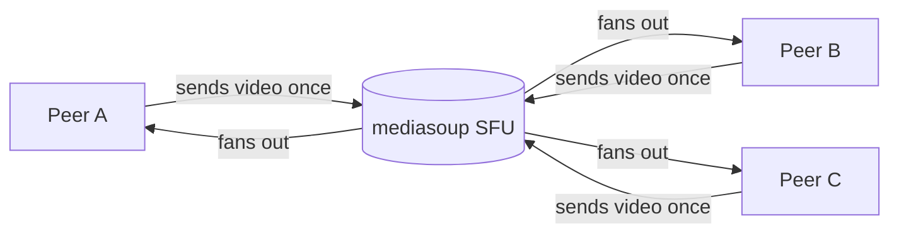

# openmeet

> *Open-source group video calling. A WebRTC SFU you can read in an afternoon.*

<p align="left">
  <a href="https://github.com/krish9219/openmeet/stargazers"></a>
  <a href="https://github.com/krish9219/openmeet/blob/main/LICENSE"></a>
  
  
  
</p>

Most "open-source Zoom" projects either (a) wrap an existing iframe and call themselves a Zoom clone, or (b) ship 100k lines of code you'll never read. openmeet is the actual thing in the middle: a real Selective Forwarding Unit (mediasoup), real WebSocket signaling, a vanilla-JS client, and a single-file architecture that fits on one screen.

```bash
git clone https://github.com/krish9219/openmeet
cd openmeet
npm install
npm start
# open http://localhost:3000 in two browser tabs, join the same room name
```

## How group video actually works



A mesh (every peer sends to every other peer) is N² connections — your laptop's upload dies past 3 people. An SFU fixes this: every peer sends *once* to the server; the server forwards each stream to every other peer. That's the only architectural choice that matters for group video.

## Quick start

```bash
git clone https://github.com/krish9219/openmeet
cd openmeet
npm install      # compiles the mediasoup C++ worker (~30s)
npm start
```

Open **http://localhost:3000**, enter a name and room, hit Join. Open a second browser tab (or another machine on the same network), join the same room name. You should see each other.

To test on two machines on the same Wi-Fi:

```bash
# On the host machine, find your LAN IP (e.g. 192.168.1.42)
LISTEN_IP=192.168.1.42 npm start
# Both machines open http://192.168.1.42:3000
```

## Features

- **Real SFU** — mediasoup. The same library backing Discord, Around, Around, plenty of production stacks.
- **Audio + video + screen share** — three independent producers per peer; mute/unmute independently.
- **Multi-room** — `/r/room-name` is the join URL; rooms are created lazily and destroyed when empty.
- **Vanilla JS client** — no React, no build step. Open `public/client.js` and read the entire client in one sitting.
- **One file per concept** — `server.js` is signaling; `lib/room.js` is room/peer state; `lib/config.js` is everything you'd tune.
- **Lazy rooms** — first peer in creates the mediasoup Router; last peer out destroys it. No DB, no cleanup job.

## What this is NOT

This is the honest part — read it before deploying.

- **No TURN server.** ~10–15% of users behind strict NATs (corporate firewalls, mobile carriers with symmetric NAT) cannot connect. Adding TURN means running `coturn` or paying a service. Documented; not built in.
- **No HTTPS in dev.** Browsers require HTTPS for `getUserMedia` and `getDisplayMedia` in production. `localhost` is exempt, so dev works. For deployment, put nginx + Let's Encrypt in front.
- **No authentication.** Anyone with the URL can join the room. Wrap with reverse-proxy auth, or implement a token grant (~50 LOC).
- **No recording.** mediasoup can pipe streams to a recorder via `PipeTransport`; the hooks are there. The plumbing is not.
- **One worker.** A single mediasoup worker is one CPU core; capacity tops out around 500–1000 simultaneous streams depending on bitrate. Scaling means a worker pool — `cluster` mode or load-balanced instances.
- **No mobile native.** Browser WebRTC works on mobile Safari and mobile Chrome. Native iOS/Android clients are out of scope.

## Architecture

```
openmeet/
  server.js                Express + WebSocket signaling + mediasoup boot
  lib/
    config.js              All tunables: ports, listenIp, codecs, transport opts
    room.js                Room + Peer classes — state only, no IO
  public/
    index.html             Lobby (name + room)
    room.html              Video grid + controls
    client.js              mediasoup-client wiring; the whole client
    styles.css             ~200 lines of CSS
```

Total: ~1500 lines including styling.

## Signaling protocol

Plain JSON over WebSocket. All client → server requests have an `id`; the server's reply echoes it. Server → client broadcasts have no `id`.

| Client → Server | Server → Client (reply) |
|---|---|
| `join {roomId, displayName}` | `{peerId, routerRtpCapabilities, peers}` |
| `createTransport {direction}` | `{id, iceParameters, iceCandidates, dtlsParameters}` |
| `connectTransport {transportId, dtlsParameters}` | `{}` |
| `produce {transportId, kind, rtpParameters, appData}` | `{producerId}` |
| `consume {transportId, producerId, rtpCapabilities}` | `{id, producerId, kind, rtpParameters}` |
| `closeProducer {producerId}` | `{}` |

Server → Client broadcasts: `peerJoined`, `peerLeft`, `newProducer`, `producerClosed`, `consumerClosed`.

## Configuration

| Env var | Default | Notes |
|---|---|---|
| `PORT` | `3000` | HTTP / WebSocket port |
| `LISTEN_IP` | `127.0.0.1` | Set to your LAN IP for two-machine testing, `0.0.0.0` for public |
| `ANNOUNCED_IP` | (unset) | Public IP to advertise in ICE candidates. Set for deployments where `LISTEN_IP` is `0.0.0.0` behind NAT |
| `RTC_MIN_PORT` | `40000` | First UDP port mediasoup uses for RTP |
| `RTC_MAX_PORT` | `40100` | Last UDP port |

For production: open `RTC_MIN_PORT`–`RTC_MAX_PORT` UDP on your firewall, set `LISTEN_IP=0.0.0.0` and `ANNOUNCED_IP=<your.public.ip>`, terminate TLS at nginx, and ideally add a TURN server.

## vs. the alternatives

| | openmeet | Jitsi Meet | LiveKit | Zoom |
|---|---|---|---|---|
| **Read every line of code in a weekend** | yes | no (huge) | partial | n/a (closed) |
| **Self-hosted** | yes | yes | yes | no |
| **Group calls (SFU)** | yes | yes | yes | yes |
| **Recording out of the box** | no | yes | yes | yes |
| **Mobile native clients** | no | yes | yes | yes |
| **Production-ready** | no (no TURN, no auth) | yes | yes | yes |
| **Best for** | learning + small self-hosted rooms | full self-hosted Zoom | SDK-first apps | non-technical users |

If you want **a working open-source video conferencing product**, use **Jitsi Meet** (deploy via Docker, 30 minutes). If you want to *understand* how group video works and have a base you can extend, this is for you.

## License

MIT — see [LICENSE](LICENSE).
